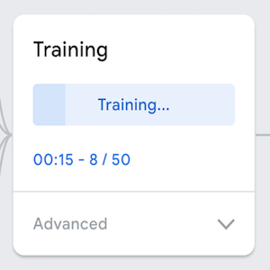
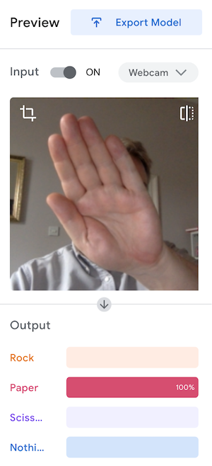
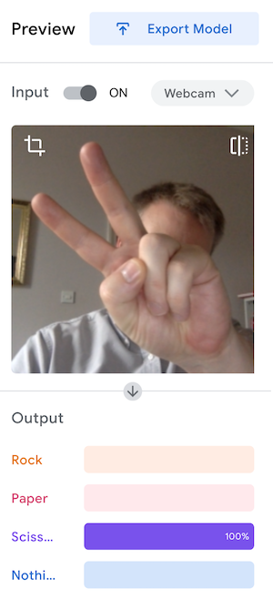

# Computer Vision Rock-Paper-Scissors

This project recreates the classic game Rock-Paper-Scissors, pitting the user against the computer in a best-of-three encounter.
The rules of the game are simple - after a countdown both players present a hand gesture representing one of either Rock, Paper
or Scissors:

*Image credit: https://www.popularmechanics.com/culture/gaming/a31213381/rock-paper-scissors-history/*

Rock defeats Scissors, Paper defeats Rock, Scissors defeats Paper. When both players present
the same gesture, the round is a tie.

In a modern twist, the user presents their hand gesture to their computer webcam, the image is captured, computer vision machine 
learning takes over and makes a prediction of which gesture the user presented.

# Project Dependencies

In order to run this project, the following modules need to be installed:

- `opencv-python`
- `tensorflow`
- `ipykernel`

It's recommended that a new virtual environment is created for this project, and the dependencies installed within the virtual
environment. [Conda](https://docs.conda.io/en/latest/) is an excellent solution for creating and managing virtual environments.

To create a new virtual environment in Conda type the following command in the terminal,

`conda create -n $ENVIRONMENT_NAME`

where `$ENVIRONMENT_NAME` is whatever name you choose for the environment. Then run the following command to activate the new
virtual environment:

`conda activate $ENVIRONMENT_NAME`

At the time of writing, you will need to use `pip` to install `opencv-python`:

`conda install pip`

`pip install opencv-python`

Conda can be used to install `tensorflow` and `ipykernel` in your new virtual environment. Run the following in the terminal:

`conda install $PACKAGE_NAME`

Alternatively, the Conda environment can be cloned by running the following command, ensuring that env.yaml is present in the
project:

`conda create env -f env.yaml -n $ENVIRONMENT_NAME`

# Manual version of the game

The file `manual_rps.py` contains a single-round, manual version of the game where the user can input their choice manually.
Run this file from the terminal to play. No dependencies are required for this file to run.

`python manual_rps.py`

# Camera version of the game

Running the file `camera_rps.py` from the terminal will launch a full game of the camera version of rock-paper-scissors,
where you play against the computer. Follow the instructions on the screen to play. Pressing 'q' between rounds will end
the game early. Before each round, press 'c' to start the countdown timer - display your gesture to the webcam and it will
be captured when the timer reaches zero. Check the terminal for the round result and the current score - first to three rounds
wins the game overall!

`python camera_rps.py`

# The machine learning model

The user gesture is captured by making a classification of the webcam image content using a [Keras](https://keras.io/about/)
machine learning model generated using the web app [Teachable Machine](https://teachablemachine.withgoogle.com).

A previously saved Keras model, in the form of a .h5 file, can be loaded using the `load_model()` function from the `models`
module of Keras.

`from keras.models import load_model`

`model = load_model("keras_model.h5", compile=False)`

The `predict()` method can then be used to generate an output prediction for the input sample (in this case, a webcam image).

`prediction = model.predict(image)`

You can get the index of the strongest prediction:

`index = np.argmax(prediction)`

Teachable Machine generates a .h5 file containing the model, and a 'labels.txt' file. This can be used to generate a list of
the model class labels. You can then use the index of the strongest prediction to obtain the string representation of that
class.

`class_names = open("labels.txt", "r").readlines()`

`predicted_class = class_names[index]`

## Training your own model

Chances are, the model contained in this repository (trained with my gestures, face and background) will not be very good at 
classifying another user's gestures. Therefore, I'd suggest training your own model.

To do this, visit [Teachable Machine](https://teachablemachine.withgoogle.com) and click on the 'Get Started' button. Then,
choose 'Image Project' and 'Standard Image Model'. You will see the following screen:

You can edit the class names and add new classes to your project - for a model to work with the code in this project, you'll
need four classes:
- Rock
- Paper
- Scissors
- Nothing

Each class needs data to train from. You can either upload images or capture them directly using the webcam. To capture them
directly, click on the 'Webcam' button, make your gesture visible in the frame, and click and hold the 'Hold to Record' button.
Images will be captured for the entire duration you hold down the button. The more images you capture, the better the model
should be. Try experimenting with different backgrounds, lighting conditions, changing hands etc.

Once you have captured images of each of your four classes, you are ready to train the model.

Click on the 'Train Model' button to kick off the process of training the classification. The advanced dropdown button offers
more customisation over the training paramaters should you wish. Don't switch tabs during training, as the process will pause
and only complete once you return focus to Teachable Machine tab.

When the model is finished training, you will be able to preview the model by presenting your gestures to the webcam.

Finally, click on the 'Export Model' button, select the 'Tensorflow' tab and 'Keras' radio button, then click the 'Download
my model' button to download a .zip file containing the following files:

- keras_model.h5
- labels.txt

Place these files in the project root folder to use them with your copy of this project.

# Thoughts and next steps
Overall, I'm happy with the outcome of this project and what I've learned about writing functions and classes, and using the
@contextmanager decorator.

For future work, it might be nice to have the round results and final game result written to the screen instead of the terminal.
I also think a good feature would be a check on the user input i.e. 'It looks like you chose paper - is this correct?'. And
then if the machine learning model is having trouble correctly classifying the user gesture, giving the user the opportunity
to input the choice manually.

